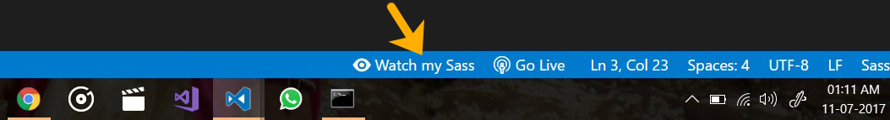

# Forked by [Varstahl](https://github.com/Varstahl/vscode-live-sass-compiler)

This extension is a forked and modified version of [ritwickdey's Live Sass Compiler](https://github.com/ritwickdey/vscode-live-sass-compiler) VSCode extension. It has much needed fixes and several additional features contributed by various developers:

* [@jeremy-wells152](https://github.com/jeremy-wells152)
  * Removed dependency on live-server extension.
  * Added input/output folder options for non-relative folder structure.
  * Turning on watch-mode does not compile all sass in the project.
* [@boyum](https://github.com/boyum) cleanups
* [@MrNightingale](https://github.com/MrNightingale) readme fixes
* [@bmwigglestein](https://github.com/bmwigglestein) auto watch on launch

The updated fork and the changes applied by the aforementioned and I are mainly for a few people's benefit (myself included). You're free to use the packaged releases that are provided as-is with no guarantees.

# Live Sass Compiler

A VSCode Extension that helps you to compile/transpile your SASS/SCSS files to CSS files in realtime.

## Usage/Shortcuts
1. Click to `Watch Sass` from Statusbar to turn on the live compilation and then click to `Stop Watching Sass` from Statusbar to turn off live compilation. 

2. Press `F1` or `Ctrl+Shift+P` and type `Live Sass: Watch Sass` to start live compilation or, type `Live Sass: Stop Watching Sass` to stop a live compilation.
3. Press `F1` or `Ctrl+Shift+P` and type `Live Sass: Compile Sass - Without Watch Mode ` to compile Sass or Scss for one time.

## Features
* Live SASS & SCSS Compile.
* Customizable file location of exported CSS.
* Customizable exported CSS Style (`expanded`, `compact`, `compressed`, `nested`).
* Customizable extension name (`.css` or `.min.css`).
* Quick Status bar control.
* Exclude Specific Folders by settings. 
* Autoprefix Supported (See setting section)

## Installation
Open Visual Studio Code, press `F1` or `Ctrl+Shift+P` to open the command palette, choose `Extensions: Install from VSIX`, and select the latest VSIX you downloaded from the [releases](https://github.com/Varstahl/vscode-live-sass-compiler/releases).

## Documentation
* [Settings](./docs/settings.md)
* [FAQ](./docs/faqs.md)
* [Changelog](CHANGELOG.md)

## LICENSE
This extension is licensed under the [MIT License](LICENSE)
